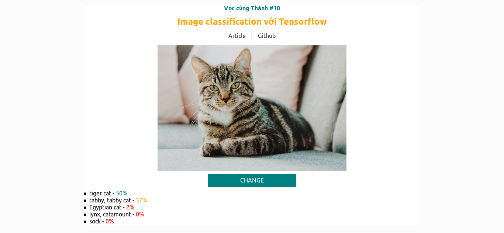

# Vọc cùng Thành #10 - Image classification với Tensorflow

## Giới thiệu

**Vọc cùng Thành #10 - Image classification với Tensorflow** là một webapp phân loại hình ảnh dưới dạng tag sử dụng [Tensorflow][tensorflow] [(mobilenet model)][mobilenet].



[**Demo**][demo] | [**DevNow Article**][post]

## Yêu cầu

- [git][git]
- [node][node]

## Cài đặt

```bash
# Clone repo
git clone https://github.com/EGANY-Team/vct-10-image-classification-w-tensorflow
cd vct-10-image-classification-w-tensorflow

# Install package
npm install

# Dev: http://localhost:3000
npm start

# Build
npm run build
```

## Tài liệu tham khảo

- [DevNow][post]
- [Tensorflow][tensorflow]
- [Mobilenet][mobilenet]

[post]: https://devnow.vn/?p=3142
[tensorflow]: https://www.tensorflow.org/js
[git]: https://git-scm.com
[node]: https://nodejs.org
[mobilenet]: https://github.com/tensorflow/tfjs-models/tree/master/mobilenet
[demo]: https://vct-10.thanhnguyen.now.sh/